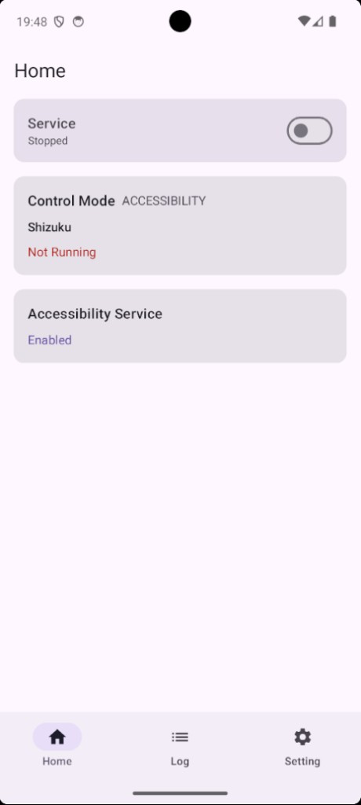
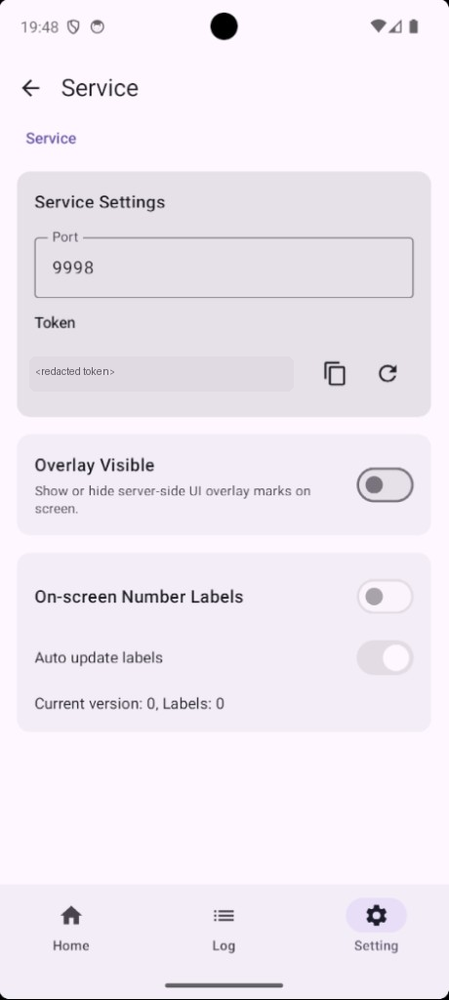

# Autofish

[English](./README.md) | 中文

**面向 agent 和多 agent 系统的 Android 控制基础设施。**

Autofish 给任何 agent 提供稳定、明确、可观测的 Android 执行层：检查屏幕，通过稳定 refs 而不是脆弱坐标执行动作，在每一步之后验证结果，并通过本地执行记忆进行恢复。

```text
人 → agent → autofish → Android 设备
      ↑                      |
      └── 观测 / 验证 ────────┘
```

## 工作方式

Autofish 包含两个组件：

**Android 服务** — 设备上运行的前台服务，暴露 HTTP API。负责截图、UI 树检查、点击/滑动/文字输入执行、以及屏幕覆盖层标注。

**CLI (`af`)** — Rust 编写的命令行工具，通过 HTTP 与服务通信。提供命令接口，管理本地工具记忆（SQLite），处理产物存储。通过 npm（`@memohjs/af`）分发。

## 安装并连接

从 [GitHub Releases](https://github.com/memohai/Autofish/releases) 安装最新 APK，然后在 Android 设备上打开应用：

1. 启用 Autofish 无障碍服务。
2. 可用时启用 Shizuku 支持。
3. 在 Autofish 首页打开 **Service**。
4. 复制应用中显示的 `IP`、`PORT` 和 `TOKEN`。

<p>
  
  
</p>

Shizuku 设置：

- 从 [RikkaApps/Shizuku GitHub Releases](https://github.com/RikkaApps/Shizuku/releases) 安装 Shizuku。
- 按照官方 [Shizuku 设置指南](https://shizuku.rikka.app/guide/setup/) 启动 Shizuku。
- Root 设备可以直接在 Shizuku 应用内启动。
- Android 11+ 设备可以在 Shizuku 应用内使用无线调试启动，不需要电脑。
- USB ADB 用户可以把设备连接到电脑，然后运行 Shizuku 应用中显示的启动命令。
- 设备重启后通常需要重新启动 Shizuku。

注意：

- 执行 `af health`、`observe`、`act` 或 `verify` 之前，必须打开 **Service**。
- 如果 Shizuku 没有运行，只要 **Accessibility Service** 已启用，Autofish 仍可使用无障碍回退路径。
- 服务设置页会显示 `PORT` 和 `TOKEN`。请把 token 当作密钥处理，不要公开包含它的截图或日志。
- 如果通过 USB 和 adb 端口转发连接，请转发应用中显示的同一个端口，并使用 `http://127.0.0.1:<PORT>` 作为 `remote.url`。

在开发机上安装 CLI：

```bash
npm i -g @memohjs/af
```

用 Android 应用里的连接信息配置 CLI：

```bash
af config set remote.url "http://<IP>:<PORT>"
af config set remote.token "<TOKEN>"
af config set memory.db "$HOME/.config/af/af.db"
af config set output.default "text"
af config set artifacts.dir "$HOME/.config/af/artifacts"
```

把控制权交给 agent 前，先检查服务：

```bash
af health
af observe page --field screen --field refs --max-rows 80
```

## 配置 Autofish Skill

标准 skill 文件是：

```text
cli/skills/autofish-control/SKILL.md
```

为 Codex 全局安装：

```bash
mkdir -p "$HOME/.agents/skills/autofish-control"
cp cli/skills/autofish-control/SKILL.md "$HOME/.agents/skills/autofish-control/SKILL.md"
```

为 Claude Code 全局安装：

```bash
mkdir -p "$HOME/.claude/skills/autofish-control"
cp cli/skills/autofish-control/SKILL.md "$HOME/.claude/skills/autofish-control/SKILL.md"
```

## 使用 Autofish

Autofish 最可靠的使用方式是：每次动作都基于新鲜观测，并在动作后进行验证。

### 1. 创建 session

每个任务使用一个稳定的 session 名称，让记忆和事件日志保持一致：

```bash
SESSION="settings-wifi"
```

### 2. 观测当前页面

```bash
af --session "$SESSION" observe page --field screen --field refs --max-rows 80
```

使用返回的 refs 进行交互。像 `@n3` 这样的 ref 指向最近一次观测中的可点击 UI 节点。

### 3. 只执行一个动作

优先使用 ref 点击：

```bash
af --session "$SESSION" act tap --by ref --value @n3
```

其他常用动作包括：

```bash
af --session "$SESSION" act launch --package com.android.settings
af --session "$SESSION" act text --text "hello"
af --session "$SESSION" act back
af --session "$SESSION" act home
af --session "$SESSION" act swipe --from 500,1600 --to 500,600 --duration 400
```

### 4. 再次观测并验证

```bash
af --session "$SESSION" observe page --field screen --field refs --max-rows 80
af --session "$SESSION" verify text-contains --text "Wi-Fi"
```

验证应用导航时，`top-activity` 通常是更好的检查方式：

```bash
af --session "$SESSION" verify top-activity --expected "Settings" --mode contains
```

### 5. 保存有用经验

遇到非平凡导航或恢复路径时，保存有效经验：

```bash
af --session "$SESSION" memory save --app com.android.settings --topic "nav/home-to-wifi" \
  --content "从设置主页点击 @n3 (Wi-Fi)，然后验证文本包含 Wi-Fi。"
```

重复类似任务前，先查询记忆：

```bash
af --session "$SESSION" memory context
af memory search --app com.android.settings
af memory experience --app com.android.settings
```

### 6. 从不确定状态恢复

如果 UI 意外变化，不要继续使用过期 refs。重新观测、检查最近失败，然后执行一个恢复步骤：

```bash
af --session "$SESSION" observe page --field screen --field refs --max-rows 120
af memory log --for-session "$SESSION" --status failed --limit 5
af --session "$SESSION" recover back --times 1
af --session "$SESSION" observe page --field screen --field refs --max-rows 80
```

人和 agent 都适用同一个循环：观测，执行一个动作，再次观测，验证，然后继续。

## 工具记忆

CLI 维护一个本地 SQLite 数据库，追踪：

- **事件** — 每次 `act`、`verify`、`recover`，附带页面指纹、状态、失败原因和耗时。
- **状态转换** — 自动闭合的 act → verify 对，带成功/失败计数。
- **恢复策略** — 哪些恢复步骤对哪些失败原因有效。
- **Agent 笔记** — 你的 agent 写入和查询的追加式知识。

## Why Autofish

多 agent 编排是一个快速演进的领域。Agent 之间如何协调、规划、重试、委托，终将收敛出最佳实践和专用平台——就像微服务编排收敛到了 Kubernetes。设备控制是另一个关注点，不应该与之纠缠。

当规划和执行被熔在一起，agent 失去对实际行为的控制权，失败被内部消化而非暴露，采用更好的编排策略也意味着重写整个栈。

Autofish 保持边界清晰：**设备控制是基础设施，不是应用逻辑。** 你的 agent——或者未来涌现出的任何编排层——保留对规划和决策的全部权力。Autofish 提供确定性的设备操作、明确的失败信号、和可查询的执行记录。当编排的故事成熟时，Autofish 不需要变。

## 设计原则

| 原则 | 在实践中的含义 |
|---|---|
| **单一职责** | 只做 Android 观测和控制。不做规划，不调 LLM，不搞工作流引擎。 |
| **Agent-first 接口** | CLI 和服务 API 为机器消费而设计：结构化输出、确定性退出码、可组合的命令。 |
| **确定性表面** | 命令做的就是它说的。没有隐式重试，没有背后的"智能"启发式。 |
| **闭环纪律** | 每次操作前必须观测，操作后必须验证。内存模型以此为纪律。 |
| **优雅降级** | 多条执行路径共存。当首选能力不可用时，回退路径保持系统可运行。 |
| **可观测的执行** | 每次操作、状态转换、恢复都被结构化记录——agent 运行中随时可查。 |

## 文档

- [快速开始](./docs/QUICKSTART.md) — 从零到第一条命令
- [CLI 参考](./cli/README.md) — 全部命令、参数和输出格式
- [架构说明](./docs/ARCHITECTURE.md) — 服务内部、Refs 设计、API 约定
- [CLI 记忆](./docs/CLI_MEMORY.md) — 数据模型、记录规则、观测缓存
- [更新日志](./CHANGELOG.md) — 发布历史和破坏性变更

## 从源码构建

要求：JDK 17、Android SDK API 36、Rust 工具链、`just`。

```bash
just build
just install
```