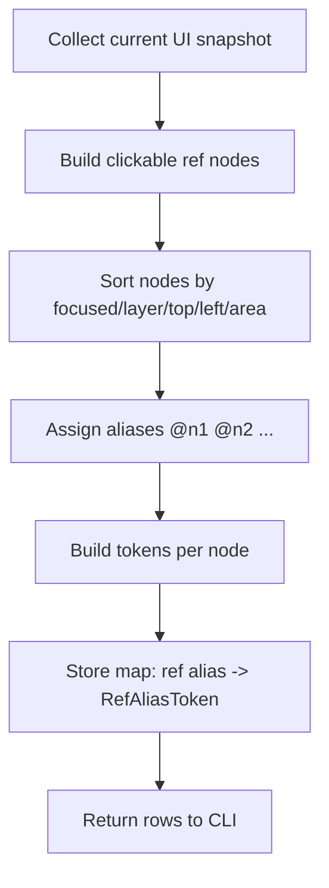
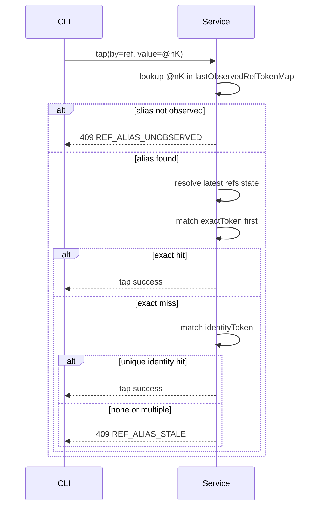

# Autofish Architecture

```text
af (CLI)
  -> HTTP + Bearer Token
  -> local adb helpers (app install, USB forwarding)
Service (foreground service)
  -> Server (Ktor)
     - /health (unauthenticated service health)
     - /api/observe (atomic top/screen/refs observation)
     - /api/screen, /api/screen/refs, /api/screenshot
     - /api/tap, /api/swipe, /api/press/*, /api/text
     - /api/nodes/tap by text/desc/resource id/ref
     - /api/overlay
     - /api/app/launch, /api/app/stop, /api/app/top
  -> ToolRouter
      -> v2: system/shizuku/shell
      -> v1: accessibility (fallback)
  -> Android device
```

`/health` is intentionally unauthenticated. `/api/*` routes require the bearer token configured in the Android app.

## USB Connection Hint

The Android app writes a non-sensitive adb-readable hint at `Android/data/com.memohai.autofish/files/connection-hint.json`.
It contains package/version metadata, `servicePort`, `serviceRunning`, and `updatedAt`; it must not include tokens, screen content, refs, logs, or task data.

`af connect usb` reads this hint with adb, creates `adb forward tcp:<localPort> tcp:<servicePort>`, verifies `/health`, and writes local CLI metadata:

- `remote.url`
- `connection.transport = "usb-forward"`
- `connection.usb.device`
- `connection.usb.local_port`
- `connection.usb.device_port`

`af connect usb` does not write `remote.token`. Agent control commands still need the token from the app, while `af health` remains token-free and reports the local connection metadata when configured.

## Refs Design

Refs are human-facing aliases (`@n1`, `@n2`, ...) for clickable nodes in the current UI snapshot.
They are designed for CLI usability, while execution correctness is enforced by server-side token resolution.

### Goals

- Keep CLI input simple (`--by ref --value @nK`).
- Avoid stale-click mistakes when UI changes between observe and act.
- Recover safely from pure ref reordering when node identity is still stable.

### Observe Flow (`GET /api/screen/refs`)



Server stores an in-memory map from alias to token pair:

- `RefAliasToken.exactToken`: strict token, includes coarse bounds.
- `RefAliasToken.identityToken`: recovery token, excludes absolute position and keeps semantic/interaction traits.

### Act Flow (`POST /api/nodes/tap` with `by=ref`)



### Token Semantics

- `exactToken` is strict and position-sensitive (coarse bounds included), used as the first guardrail.
- `identityToken` is position-insensitive (uses semantic fields + interaction flags + coarse size), used only as fallback.
- Identity fallback is accepted only when it produces exactly one candidate.

### Safety Rules

- Never trust ref index alone after UI changes.
- Never auto-pick among multiple identity candidates.
- Prefer `REF_ALIAS_STALE` over uncertain execution.

### Notes

- `refVersion` is still returned for state introspection and diagnostics.
- Ref replay correctness is based on server-side alias-token mapping, not client-side version comparison.

## CLI Tool Memory

`af` keeps tool memory in CLI-local SQLite configured by `memory.db`, `AF_DB`, or `--memory-db`. See [`docs/CLI_MEMORY.md`](CLI_MEMORY.md) for data model, recording rules, and observation cache semantics.

## Android APIs by purpose

### Position / bounds

- `AccessibilityNodeInfo.getBoundsInScreen(Rect)`
- `AccessibilityWindowInfo` (window metadata)

### Text / description

- `AccessibilityNodeInfo.getText()`
- `AccessibilityNodeInfo.getContentDescription()`
- `AccessibilityNodeInfo.getViewIdResourceName()`

### Screenshot

- v2: system/shizuku/shell path (preferred)
- v1: `AccessibilityService.takeScreenshot()` (fallback)

### Tap / swipe / back / home / input

- v2: system/shizuku/shell path (preferred)
- v1:
  - `AccessibilityService.dispatchGesture()`
  - `AccessibilityService.performGlobalAction()`
  - `AccessibilityNodeInfo` node actions / text operations

### On-screen overlay marks

- `WindowManager`
- `TYPE_ACCESSIBILITY_OVERLAY`
- Custom `View` for boxes and labels
