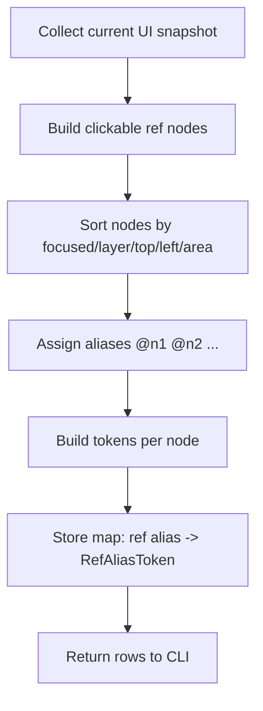
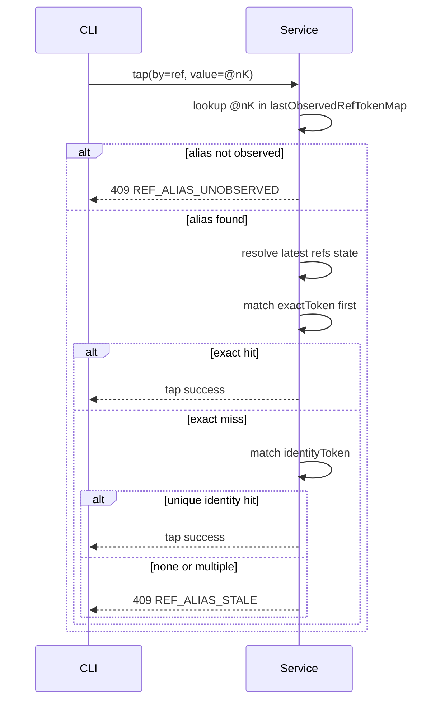

# Auto Fish server notes

Only what is currently used.

```text
af (CLI)
  -> HTTP + Bearer Token
RestServerService (foreground service)
  -> RestServer (Ktor)
     - /api/tap (coordinate tap)
     - /api/nodes/tap (semantic node tap by text/desc/resource id)
     - /api/screen/refs (clickable refs + refVersion)
     - /api/nodes/tap by=ref (server-side ref alias mapping: exact token first, identity token fallback only when unique)
  -> ToolRouter
      -> v2: system/shizuku/shell
      -> v1: accessibility (fallback)
  -> Android device
```

## Refs Design

Refs are human-facing aliases (`@n1`, `@n2`, ...) for clickable nodes in the current UI snapshot.
They are designed for CLI usability, while execution correctness is enforced by server-side token resolution.

### Goals

- Keep CLI input simple (`--by ref --value @nK`).
- Avoid stale-click mistakes when UI changes between observe and act.
- Recover safely from pure ref reordering when node identity is still stable.

### Observe Flow (`GET /api/screen/refs`)



Server stores an in-memory map from alias to token pair:

- `RefAliasToken.exactToken`: strict token, includes coarse bounds.
- `RefAliasToken.identityToken`: recovery token, excludes absolute position and keeps semantic/interaction traits.

### Act Flow (`POST /api/nodes/tap` with `by=ref`)



### Token Semantics

- `exactToken` is strict and position-sensitive (coarse bounds included), used as the first guardrail.
- `identityToken` is position-insensitive (uses semantic fields + interaction flags + coarse size), used only as fallback.
- Identity fallback is accepted only when it produces exactly one candidate.

### Safety Rules

- Never trust ref index alone after UI changes.
- Never auto-pick among multiple identity candidates.
- Prefer `REF_ALIAS_STALE` over uncertain execution.

### Notes

- `refVersion` is still returned for state introspection and diagnostics.
- Ref replay correctness is based on server-side alias-token mapping, not client-side version comparison.

## CLI Tool Memory

`af` keeps tool memory in CLI-local SQLite (`AF_DB`). See `docs/CLI_MEMORY.md` for full design.

### Data Model

- `session_state`: observation cache per session — app, activity, page fingerprint, fingerprint source, mode, has_webview, node_reliability, ref_version, observed_at. Updated by `observe top/screen/refs/page` with quality-based overwrite. This is the last observation cache, not ground truth.
- `events`: structured log of `act/verify/recover` with page fingerprint, failure cause, verify evidence, duration.
- `transitions`: auto-tracked action-outcome pairs closed by deferred verify. Keyed by (pre_page, action, verify), with success/verified/failure counters. Three-tier query: page → activity → app.
- `recoveries`: auto-tracked recovery strategies linked to failure causes. Keyed by (pre_page, failure_cause, recovery), with success/failure counters.
- `notes`: append-only agent-driven knowledge store. No UPSERT; multiple notes with same `(app, topic)` coexist.

### Write Path

```text
af observe top
  -> update session_state (app, activity only; no fingerprint)

af observe screen
  -> compute page fingerprint from UI tree rows
  -> update session_state (full cache, source=screen, always overwrites)

af observe refs
  -> compute page fingerprint from ref rows
  -> update session_state (source=refs) only when activity changed,
     current source != screen, or fingerprint is empty

af observe page
  -> request base context + selected slices in one call
  -> if topActivity is stable/non-null:
       compute fingerprint from screen rows, else refs rows, else top only
       update session_state
     else:
       keep existing identity cache unchanged

af act / verify / recover
  -> execute command
  -> read session_state for cached page context
  -> append event row (with page fingerprint, evidence, failure cause)
  -> verify: close transition (pre=act's context, post=verify's context)
  -> recover: link recovery to preceding failure
```

- No extra HTTP calls for context capture.
- Transitions close only on subsequent verify, never at act time.

### Page Fingerprint

Human-readable, stable identifier: `act=<activity>|mode=<mode>|wv=<0|1>|rid=<anchors>|cls=<classes>`.
Built from activity + mode + webview flag + res_id anchors (up to 8) + class_name anchors (up to 6).
Excludes text, desc, row count, dynamic content.

`observe screen --full` may lack structured rows; in that case memory preserves the existing fingerprint instead of rebuilding from empty data.

### Constraints

- Tool memory does not execute actions or make recommendations.
- Session observation cache is stale after act/recover until next observe.
- Server-side ref alias mapping is runtime state only; historical `@nK` refs are not stored.
- `observe page` is stability-oriented rather than strictly atomic truth: if top activity cannot be confirmed as stable during the request, the response returns `topActivity = null`.
- WebView-heavy pages often report `nodeReliability=low`; text-based verification is safer than assuming stable node/ref identity.

## Android APIs by purpose

### Position / bounds

- `AccessibilityNodeInfo.getBoundsInScreen(Rect)`
- `AccessibilityWindowInfo` (window metadata)

### Text / description

- `AccessibilityNodeInfo.getText()`
- `AccessibilityNodeInfo.getContentDescription()`
- `AccessibilityNodeInfo.getViewIdResourceName()`

### Screenshot

- v2: system/shizuku/shell path (preferred)
- v1: `AccessibilityService.takeScreenshot()` (fallback)

### Tap / swipe / back / home / input

- v2: system/shizuku/shell path (preferred)
- v1:
  - `AccessibilityService.dispatchGesture()`
  - `AccessibilityService.performGlobalAction()`
  - `AccessibilityNodeInfo` node actions / text operations

### On-screen overlay marks

- `WindowManager`
- `TYPE_ACCESSIBILITY_OVERLAY`
- Custom `View` for boxes and labels
